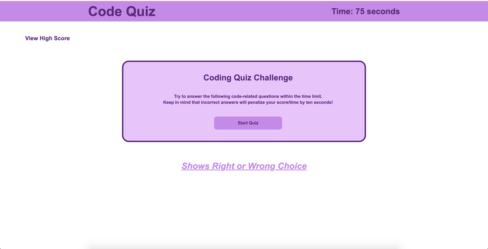

# Code Quiz

## Decription

* GIVEN I am taking a code quiz<br>
WHEN I click the start button<br>
THEN a timer starts and I am presented with a question<br>
WHEN I answer a question<br>
THEN I am presented with another question<br>
WHEN I answer a question incorrectly<br>
THEN time is subtracted from the clock<br>
WHEN all questions are answered or the timer reaches 0<br>
THEN the game is over<br>
WHEN the game is over<br>
THEN I can save my initials and score<br>
## Setup
```
git clone git@github.com:eramos3/codequiz.git
```
[working deployed link recording](https://drive.google.com/file/d/1JJv77QrIYVBU3cBpaX3sdKIqVI51KBN6/view)



[Code Quiz page](https://eramos3.github.io/codequiz/)